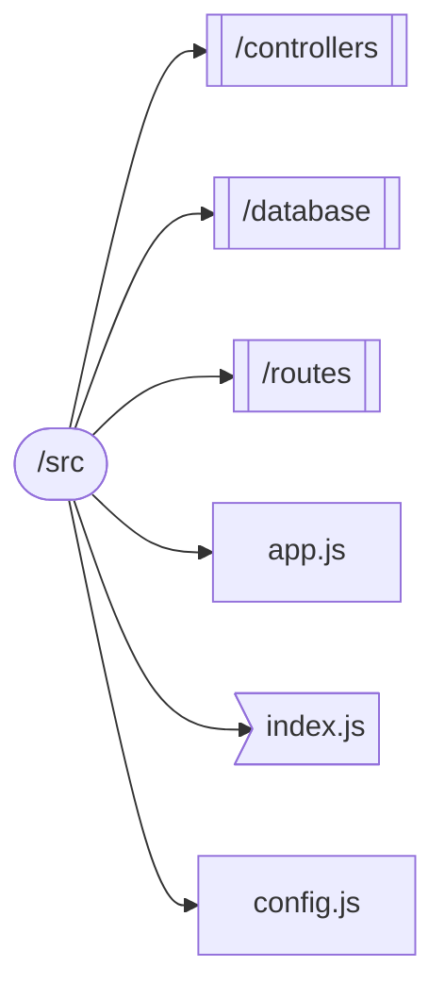

# NodeAPI

Rest API with Node.JS, Express, and MySQL.

## Goals

- Create a REST API with Node.JS, Express, and MySQL.
- With Node.js framework we can create a server that can be accessed from anywhere, using javascript. It will handle the requests and return the data.
- Express is another framework that can be manage the HTTP verbs and routes.
- MySQL is a database that can be used to store data.

---

## Logs:

### 27/09/2022

_**Setup the project:**_

- Create files and folders.
- Install dependencies.
  - dotenv -> to store the environment variables.
  - express -> to create the server with javascript and nodeJS.
  - promise-mysql -> to create async connection with database.
  - babel/cli -> to compile the code with babel.
  - babel/core -> to compile the code with babel.
  - babel/preset-env -> to compile the code with babel.
  - babel/node -> to compile the code with babel.
  - morgan -> to console log the requests.
  - nodemon -> to restart the server when the code changes.
- Create the database.

```code
>> npm i dotenv express promise-mysql --save
>> npm i babel/cli babel/core babel/preset-env babel/node morgan nodemon --save-dev
```

### Folder structure:



_**Status:**_

- On Progress.

---
